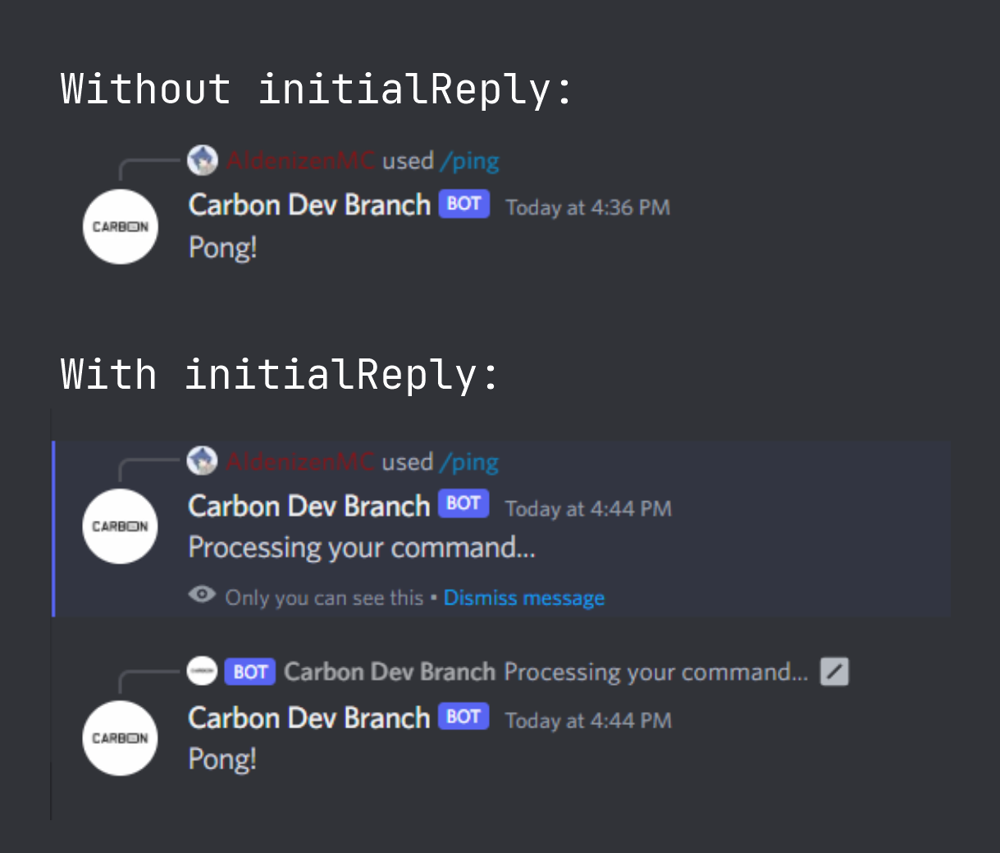

# Commands

Command files in this project can be found in the [src/commands/](../src/commands/) directory. Commands are organized into folders, and the folder structure can be as deep as needed. The project uses a glob selector, `commands/**/*.+(ts|js)`, in the [file loader](../src/functions/file_loader.ts) module, which is called from the [command handler](../src/handlers/command_handler.ts), to collect all TypeScript and JavaScript files within the events directory.

## File Structure

In the command files, you can use the following properties to configure the behavior and attributes of each command:

- **`name` (string, required):** The name of the command.
- **`disabled` (boolean):** Indicates whether the command is disabled. If `true`, the command will respond with "This command is outdated.". (logic defined in [commandListener.ts](../src/events/listeners/commandListener))
- **`hasExternalSubcommand` (boolean):** Specifies whether the command has an [external subcommand](#external-sub-commands).
- **`initialReply` (boolean):** Indicates whether the command executes with an [initial reply](#initial-reply), an alternative to `interaction.deferReply()`. This is useful for commands that takes longer to respond. (logic defined in [commandListener.ts](../src/events/listeners/commandListener))
- **`developerOnly` (boolean):** Determines whether the command is restricted to developers only. Developers can be defined in the config file.  (logic defined in [commandListener.ts](../src/events/listeners/commandListener))
- **`global` (boolean):** Specifies whether the command is a global command. If not, the command will be registered to the `devGuildId` defined in the config file.
- **`data` (object, required):** Configuration data for the command, created using `SlashCommandBuilder` from Discord.js.

Here's an example of a command file:

```typescript
module.exports = {
    name: 'ping',
    disabled: false,
    initialReply: false,
    hasExternalSubcommand: false,
    developerOnly: false,
    global: true,
    data: new SlashCommandBuilder()
        .setName("ping")
        .setDescription("Respond with 'Pong!'")
        .setDMPermission(true),
    async execute(interaction, client) {
        await interaction.reply({ content: "Pong!" })
    }
}
```

## Initial Reply



A command with an inital reply **must** use `interaction.followUp()`to respond as the interaction has already been replied to.

Here's an example of a command file with `initialReply` set to `true`:
```typescript
module.exports = {
    name: 'ping',
    disabled: false,
    hasExternalSubcommand: false,
    initialReply: true,
    developerOnly: false,
    global: true,
    commandData: new SlashCommandBuilder()
        .setName("ping")
        .setDescription("Respond with 'Pong!'")
        .setDMPermission(true),
    async execute(interaction, client) {
        await interaction.followUp({ content: "Pong!" })
    }
}
```

## External Sub Commands

Some commands in this bot feature external subcommands, allowing for modular organization and flexibility. These subcommands are defined in separate files within subdirectories of the [src/commands/](../src/commands/) directory.

### Why Split Subcommands into Different Files?

You may choose to split subcommands into different files for the following reasons:

- **Code Organization:** If a subcommand contains a significant amount of code, splitting it into separate files makes the codebase more organized and manageable.
- **Modularity:** External subcommands enable developers to work on individual subcommands independently, making it easier to add, modify, or remove specific functionality.
- **Readability:** Smaller, focused files are often easier to read and understand, especially when dealing with complex subcommands.

### File Structure

- Subcommands are organized within subdirectories named after the primary command.
- Each subcommand resides in its own file within the subdirectory.
- Subcommand files follow a similar property structure as regular commands.

  Here's an example of the file structure for a command with external subcommands:
```
commands/
├─ misc/
│ ├─ about/
│ │ ├─ about.bot.ts
│ │ ├─ about.user.ts
│ │ ├─ about.server.ts
│ ├─ about.ts
```

### Example Command

Here's an example of a **primary command** module with external subcommands:
```typescript
module.exports = {
    name: 'about',
    hasExternalSubcommand: true,
    data: new SlashCommandBuilder()
    // ... (other metadata properties)
};
```
There is no `execute()` function defined in a command file with `hasExternalSubcommand` set to `true`.

### Subcommand Files
When a user calls a subcommand, the external subcommand handler executes the corresponding subcommand file. For example, if a user calls `/about bot`, the `about.bot.ts` file is executed.

It's important to note that subcommand files may not always follow the exact same metadata structure as regular commands. In subcommand files, the following properties can be used:

- **`subCommand` (string, required):** The subcommand identifier following the format `{primary command name}.{sub command name}`.
- **`disabled` (boolean):** Indicates whether the command is disabled. If `true`, the command will respond with "This command is outdated.". (logic defined in [commandListener.ts](../src/events/listeners/commandListener))
- **`initialReply` (boolean):** Indicates whether the command executes with an [initial reply](#initial-reply), an alternative to `interaction.deferReply()`. This is useful for commands that takes longer to respond. (logic defined in [commandListener.ts](../src/events/listeners/commandListener))
- **`developerOnly` (boolean):** Determines whether the command is restricted to developers only. Developers can be defined in the config file.  (logic defined in [commandListener.ts](../src/events/listeners/commandListener))

Each subcommand file contains the logic for its respective subcommand. Here's an example of a subcommand file:
```typescript
module.exports = {
    subCommand: "about.bot",
    async execute(interaction, client) {
        // Custom logic for the 'about.bot' subcommand
    },
};
```

## Command Handler Output


The screenshot displays a log output generated by the [command handler](../src/handlers/command_handler.ts). The log provides information about the loading and status of various event files, as well as a table summarizing the loaded commands.

The line `[FILE LOADER] Loading E:/VSCode/carbon/src/commands/**/*.+(ts|js)` indicates that the `load_file()` function from [file loader](../src/functions/file_loader.ts) was called.

The lines `[HANDLER] Loading command files: a/b (commands/path/to/file.ts)` indicates that the command handler is currently loading the specified event file.

Below the loading log, there is a table displaying information about the loaded commands. The table includes the following columns:

- **# (Number):** An index or number assigned to each loaded command.
- **Command Name:** The name of the command.
- **Type:** The type of command. There are three possible types:
    - **DEV:** This type signifies that the command is intended for developers only. It means the command has the `developerOnly` property set to true, and access is restricted to authorized developers.
    - **GLOBAL:** Commands of this type are available globally, meaning they can be used by anyone in the Discord server. These commands have the `global` property set to true.
    - **SUB:** Subcommands are commands that are part of a larger command (primary command) and are meant to provide specific functionalities or options within that primary command. They are denoted as "SUB."
- **Status:** The status of the command, indicating whether it was loaded successfully (`OK` or `BAD`).
