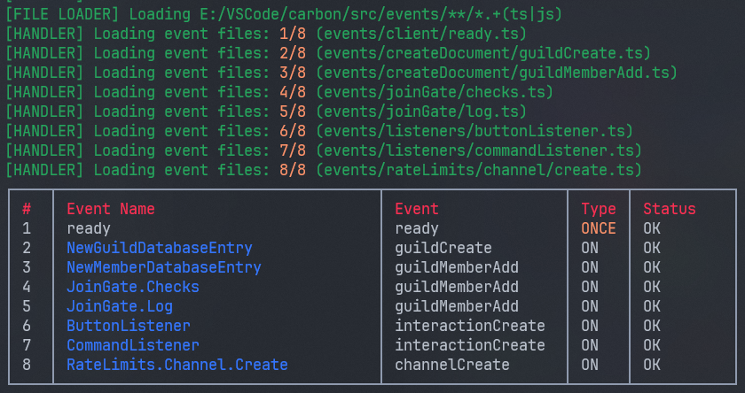

# Events

Event files in this project can be found in the [src/events/](../src/events/) directory. Events are organized into folders, and the folder structure can be as deep as needed. The project uses a glob selector, `events/**/*.+(ts|js)`, in the [file loader](../src/functions/file_loader.ts) module, which is called from the [event handler](../src/handlers/event_handler.ts), to collect all TypeScript and JavaScript files within the events directory. The event handler used is a modified version of Lyxcode's [event handler](https://www.youtube.com/watch?v=Mug61R0cxRw)

## File Structure

In the event files, you can use the following properties to configure the behavior and attributes of each event:

- **`name` (string):** The name of the event.
- **`once` (boolean):** Indicates whether the event triggers only once.
- **`friendlyName` (string, optional):** A user-friendly name for the event. If defined, it will be used as the event name in the result table with a blue foreground color.

Here's an example of an event file:

```typescript
import { Client, Events } from "discord.js";

module.exports = {
    name: Events.ClientReady,
    once: true,
    friendlyName: "LogOnReady",
    execute(client: Client) {
        console.log("Client is ready");
    },
};
```

## Event Handler Output



The screenshot displays a log output generated by the [event handler](../src/handlers/event_handler.ts). The log provides information about the loading and status of various event files, as well as a table summarizing the loaded events.

The line `[FILE LOADER] Loading E:/VSCode/carbon/src/events/**/*.+(ts|js)` indicates that the `load_file()` function from [file loader](../src/functions/file_loader.ts) was called.

The lines `[HANDLER] Loading event files: a/b (events/path/to/file.ts)` indicates that the event handler is currently loading the specified event file.

Below the loading log, there is a table displaying information about the loaded events. The table includes the following columns:

- **# (Number):** An index or number assigned to each loaded event.
- **Event Name:** The name of the event, which can be either a user-defined "friendlyName" or the original event name.
- **Event:** The actual event name that the Discord.js library recognizes.
- **Type:** The type of event, such as "ONCE" or "ON," indicating whether it triggers only once or multiple times.
- **Status:** The status of the event, indicating whether it was loaded successfully (`OK` or `BAD`).
